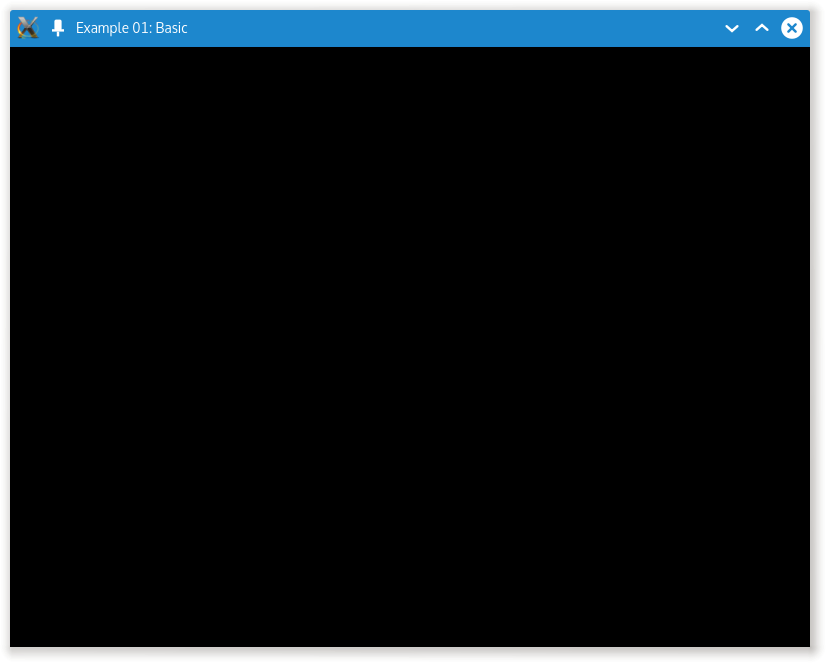
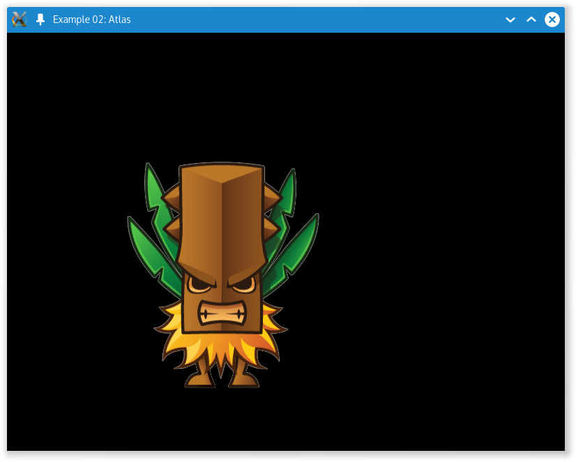
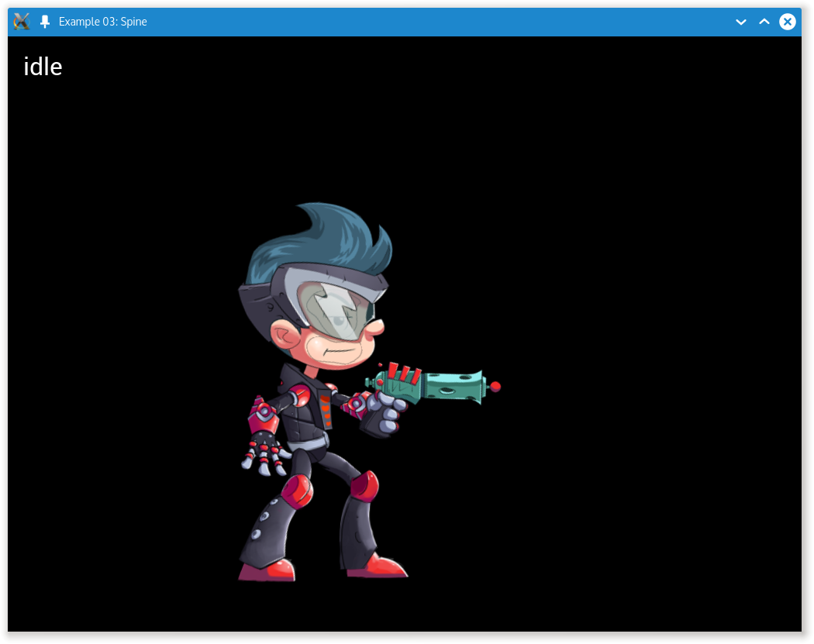
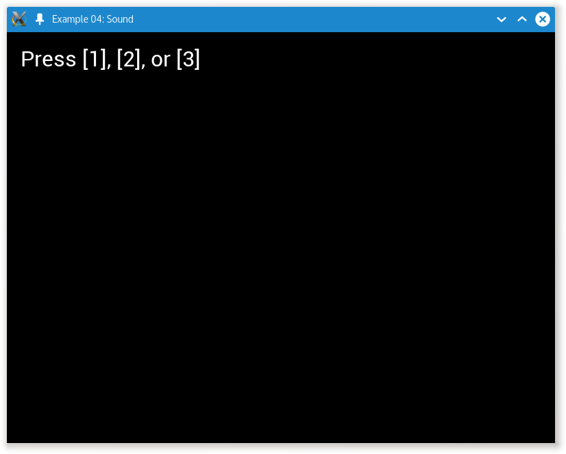
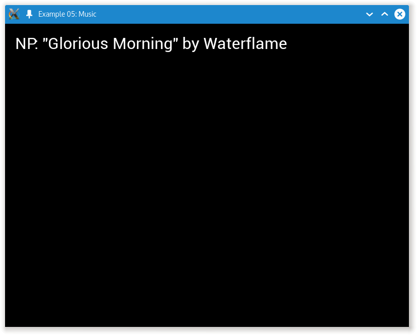
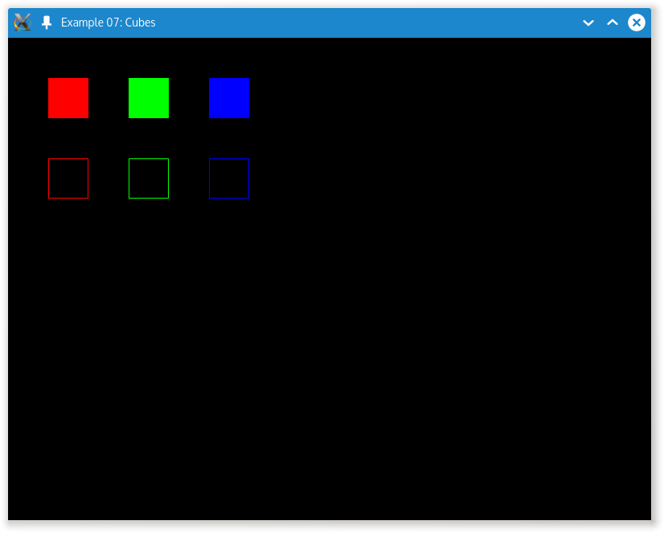
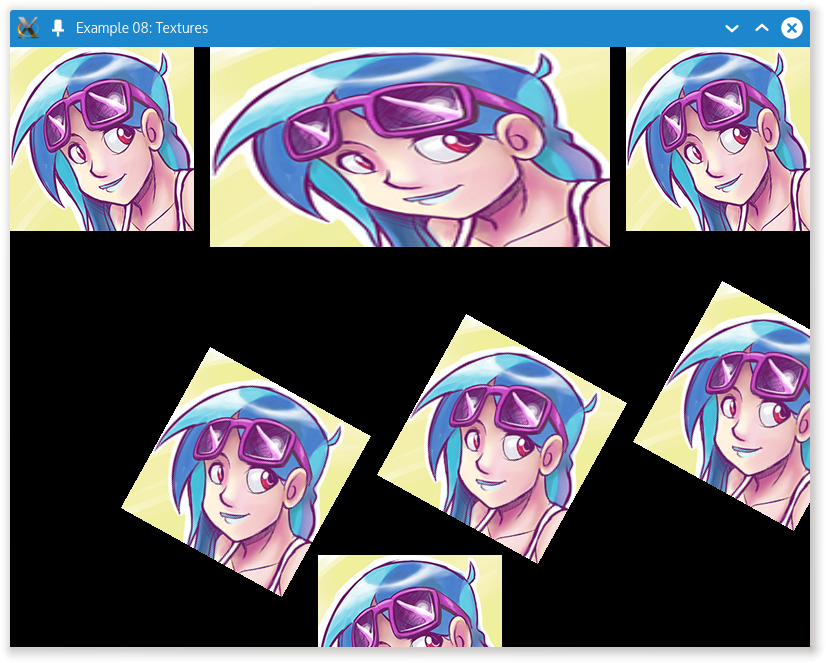

# Mragpp Examples

This folder contains simple examples on how to use Mragpp.

## basic

This is the most basic application you can make, and acts more
of a skeleton for other example projects. It simple clears the
screen and does nothing else.

## atlas

This renders a simple atlas animation using `CAtlasAnimation`.

## spine

This renders a spine animation as defined in a json export of
a spine animation. Pressing enter will cycle through different
animations.

## sound

Plays sounds if you press 1, 2, or 3 on your keyboard.

## music

Plays music.

## shader

Renders a texture with a very simple (animating) shader, defined
in glsl.

## cubes

Renders some cubes.

## textures

Renders some textures.

